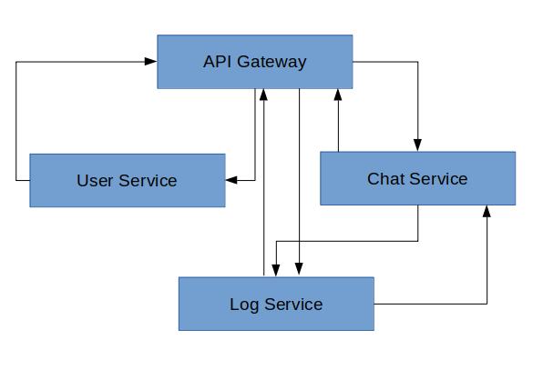

# Node Express Microservice

## Description
* We have three micro services to communicate with api gateway, they also can communicate each othre internelly.

## Technology
- [x] Node
- [x] ExpressJS
- [x] Best Practice Structure
- [x] Async Await

## Requirements
* To run this project, nodejs and git (version control) should be installed.
* Node ^8

### node
* [Node](http://nodejs.org/) is really easy to install & now include NPM. You should be able to run the following command after the installation procedure below.
  $ node --version
  $ npm --version

## Quick Start
* git clone https://github.com/arshealam4/node-express-microservice.git
* cd node-express-microservice/api-gateway
* npm install
* npm start

## Microservice Description

### api-gateway
* we can connect with all below services with api-gateway
* we can route with each services based on requested url.

### user-service
* we can get all users and user by id.
* run loadData.ts to load users
* go to inside user-service and start server(npm run start:dev)

### log-service
* we can get all logs and log by id.
* we also can connect with notification-service from here and send notification.
* go to inside log-service and start server(npm run start:dev)

### chat-service
* we can send notification.
* go to inside notification-service and start server(npm run start:dev)

